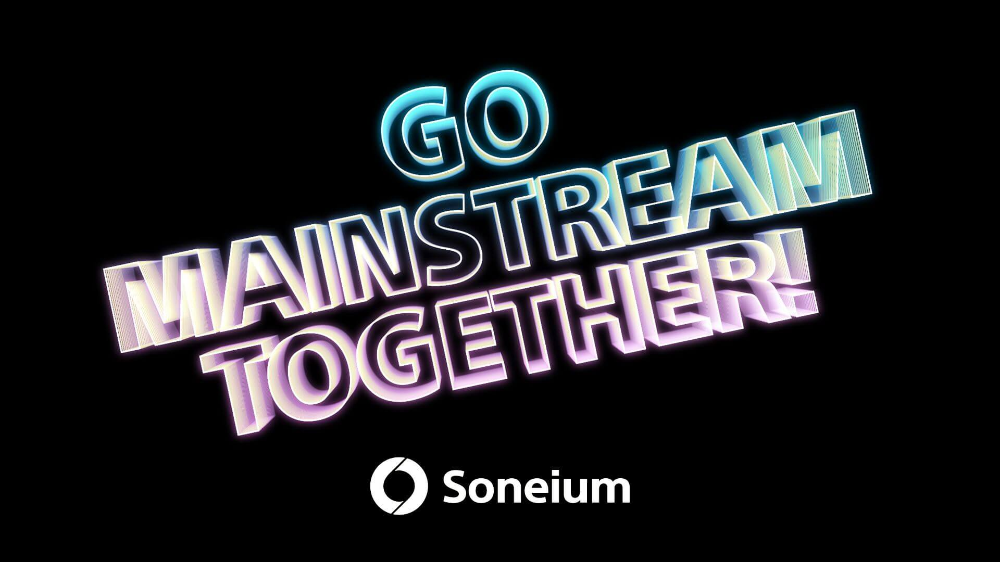

  

 

  Tool examples to kickstart your next project on Soneium!

  <a href="https://docs.soneium.org/docs/" target="_blank" rel="noreferrer">Documentation</a> •
  <a href="https://soneium.org/" target="_blank" rel="noreferrer">Website</a> •
  <a href="https://x.com/Soneium"  target="_blank" rel="noreferrer">X</a> •
  <a href="https://discord.gg/soneium"  target="_blank" rel="noreferrer">Discord</a>

 

# Soneium Examples

#### Contracts

- [Hardhat Example](https://github.com/Soneium/soneium-example/tree/main/smart-contracts/nft-hardhat)

#### Indexer

- [The Graph Example](https://github.com/Soneium/soneium-example/tree/main/indexer/example-the-graph)

#### Web Apps

- [WAGMI + RainbowKit Example](https://github.com/Soneium/soneium-example/tree/main/apps/dapp-wagmi-rainbowkit)

## Disclaimer

We’re eager for you to start building on Soneium, but it's important that you fully understand the details of the software and smart contracts provided here.

THIS SOFTWARE IS PROVIDED ON AN “AS IS WHERE IS” BASIS WITHOUT ANY REPRESENTATION OR WARRANTY, OF ANY KIND, WHETHER EXPRESS, IMPLIED OR STATUTORY, INCLUDING ANY IMPLIED WARRANTIES OF MERCHANTABILITY, FITNESS FOR A PARTICULAR PURPOSE, TITLE AND NON-INFRINGEMENT. WE MAKE NO REPRESENTATION, WARRANTY, UNDERTAKING, GUARANTEE OR ASSURANCE WITH RESPECT TO THIS SOFTWARE, INCLUDING BUT NOT LIMITED THAT IT IS SECURE, OR ERROR-FREE, OR FREE OF VULNERABILITIES OR VIRUSES OR BUGS.
YOUR USE OF THE SOFTWARE IS AT YOUR SOLE RISK. YOU SHOULD CONDUCT YOUR OWN INDEPENDENT DUE DILIGENCE AND COMPLY WITH ALL APPLICABLE LAWS. WE ARE NOT RESPONSIBLE FOR ANY LOSSES OR DAMAGES WHATSOEVER THAT YOU SUFFER OR INCUR FROM USING THE SOFTWARE.
